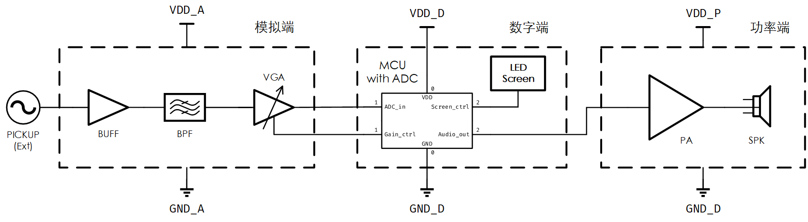

# 模拟前端&调音模块初步设计

TODO:

- [ ] BUFF：CMOS放大器选型
- [ ] BPF：电路设计
- [ ] VGA：opamp选型
- [ ] VGA：MCU-AGC

## 概述

本模块为电吉他智能音箱的模拟前端，主要功能如下：

1. 模拟滤波与放大

将拾音器输出的微弱模拟信号（峰峰值一般小于0.5Vpp），经带通滤波后放大，为后续的数字算法（频率检测、音色生成）以及数字音频信号的功率放大提供高质量的原始数据。

2. 音高校准

ADC将模拟信号数字化后，通过软件侧的频率检测算法，识别当前音高频率，并与用户设置的基准音高频率进行比较，将当前音高与差异可视化，输出至屏显。

## 系统框图

拾音器(PICKUP)位于模块外部。

模拟端包括缓冲器(BUFF)、带通滤波器(BPF)与可调增益放大器(VGA)；单片机(MCU)、模-数转换器(ADC)与LED屏显属于数字端；功放以及扬声器属于功率端。

*功率端不在本模块的范畴内，本文档不做说明*

## 方案调研与对比

人耳可分辨的极限频率范围大致是20Hz\~20kHz（后称听觉频段），需要带通滤波器保留该频段内的信号，滤除其他干扰。吉他常见音高对应的频率分布在80Hz\~1.3kHz（称为基频频段）内，泛音/高次谐波可达10kHz。

对于音高识别，其主要是测量基频的频率。拾音器输出中很可能出现高次谐波幅度高于基波幅度的情况，会影响后续数字算法对频率的测量，因此需要基频频段的带通滤波器。

对于后续放大输出，由于吉他的音色是基频与泛音共同的作用的结果，为保证音色的饱满，不能使用经基频频段滤波后的信号。

从以上两点可看出，本模块需要两个带通滤波器。根据带通滤波器在链路中所处的位置以及实现，有以下方案：

- 双通路+全模拟滤波

设计有两路通路——校音通路（Ⅰ路）与功放通路（Ⅱ路）。前者用于音高校准，通过基频频段的带通滤波器；后者用于电吉他的声音输出，通过听觉频段的带通滤波器。由选通信号控制通路是否打开。两个滤波器均通过模拟实现

- **单通路+基频频段数字滤波**

设计仅有单通路，听觉频段带通滤波器为模拟实现，基频频段通过ADC采样后数字滤波得到。

本模块采用单通路的方案，原因如下：

1. 仅需一个模拟滤波器，降低硬件设计成本；
2. 引入更少的模拟器件噪声，更小的温漂；
3. 数字滤波的可调性远胜模拟滤波，可根据需要调整频段与效果。

## 子模块说明

### 供电 SUPPLY

模拟端与数字端的供电轨分开，分别为VDD_A与VDD_D，通过两路线性电压源提供，电平暂定均为5V。

模拟地GND_A与数字地GND_D做区分，最终在PCB上通过0欧姆电阻或磁珠于单点相接，避免数字端的高频噪声耦合到模拟端形成干扰。

### 拾音器 PICKUP

外部拾音器利用电磁感应原理，通将琴弦振动的物理信号转换为电信号（模拟）。

拾音器的技术参数目前仍在查询，需要关注**输出阻抗、输出信号幅度范围**。计划在拾音器后连接示波器，测量吉他-拾音器的输出波形。

### 缓冲器 BUFF

缓冲器作为模块内外的隔离，实现阻抗变换：高输入阻抗作为拾音器的负载、低输出阻抗驱动后级。

CMOS运放具有极高的输入阻抗，因此可以将**CMOS运放接成电压跟随器**以实现缓冲与隔离功能。拾音器不能直接连接CMOS运放的输入管脚，运放对输入共模电平有一定要求，需要额外提供确定的共模电平（偏置）。暂采用AC耦合，通过电阻分压网络提供半供电轨（VDD_A/2）的共模电平。

在此之外，缓冲器需要具有一定的*过压过流保护*能力。绝大部分的集成CMOS运放都已内置保护电路，但保险起见，在其外添加肖特基二极管组成的输入钳位电路，使输入电压钳位在VDD_A和GND之间，避免静电或大信号损坏运放。

### 带通滤波器 BPF

根据先前的方案调研，这里带通滤波指听觉频段的滤波。

滤波器存在两类方案，一类是数字实现，另一类是模拟实现。

- 数字实现

该方案中，滤波器位于ADC采样之后，在单片机内通过软件算法实现。

- 模拟实现

该方案中，滤波器位于ADC采样之前，通过物理器件实现。

- 对比

| **方案** |                        **优点**                        |                           **缺点**                           |
| :------: | :----------------------------------------------------: | :----------------------------------------------------------: |
| 数字实现 | 软件端易于实现，省去了器件上的考虑 通带范围容易调整 | 效果有限，受限于ADC的性能 频率检测可能受高次谐波/泛音干扰 |
| 模拟实现 |             不受限于ADC的性能以及谐波干扰              | 需要一定模拟电路的设计 通带范围难以调整（需要调整电子器件的参数） 引入硬件器件噪声 |

本模块选取**模拟实现**，暂取一阶无源带通滤波器，若有必要再考虑有源滤波器。

### 可调增益放大器 VGA

由于拾音器的信号幅度有限，一般无法满足后续ADC与频率检测对幅度的要求，因此需要设置一级放大器。该级放大器的增益可调，以适应不同幅度的输入，避免增益过大产生饱和失真，或者增益过小ADC以及频率检测输出错误结果。

**同相放大电路**是常用的电路拓扑，通过**控制反馈电阻的阻值**实现增益可调。输入采用AC耦合，输入共模电平设置为VDD/2；输出电平在VDD/2附近，可最大化利用ADC的输入范围。

基于增益是否自动控制，存在两种实现方案：

- 手动增益调整

通过一个旋钮（电位器）调整反馈电阻。后续数字端ADC采样后可指示VGA的输出幅度，从而判断增益是否合适。

- 自动增益控制

反馈电阻通过数控电阻阵列实现。数字端ADC采样后，根据幅度控制接入的反馈电阻阻值。

- 对比

|   **方案**   |   **优点**   |               **缺点**                |
| :----------: | :----------: | :-----------------------------------: |
| 手动增益调整 |   电路简单   |     依赖用户调整，增加操作复杂度      |
| 自动增益控制 | 无需用户操作 | 电路复杂-数控电阻阵列 额外算法实现 |

本模块计划以自动增益控制作为最终实施方案，但设计前期采用手动控制保证基本功能的实现。

### 单片机 MCU

单片机有两重功能，其一是实现对周边外设的控制，如控制是否接入调音、控制屏显内容；其二是实现软件端的算法，包含ADC以及后续的频率检测以及后续音色的合成。

*后续音色的合成不在本模块的范畴内，本文档不做说明*

#### 性能要求

对于单片机的性能有以下要求：

- 片上ADC采样率与精度：为保证全频段采样，采样率至少达到Nyquist频率（40kHz）；精度暂定12位
- 主频与算力：需要能完成频率的**实时检测**，同时能满足数字效果器所需的计算，合成音色。

如果测试发现单片机的片上ADC无法满足要求，需要使用单独的ADC芯片。

#### 设备控制

允许用户设置是否启用调音，对效果器进行配置。

#### 音高识别

功能上，需要完成输入信号频率的测量；允许用户设置标准音高频率；输出当前音高以及相对标准音高的偏离程度。

算法上，常见使用自相关或FFT。前者是时域上的处理。后者是频域上的处理。

计算自相关对算力要求不算大，常用的单片机能够胜任；计算FFT对算力有一定要求，单片机可能无法满足实时检测。若单片机性能不足，考虑使用DSP芯片。

### LED屏显

显示当前音高以及相对标准音高的偏离程度。