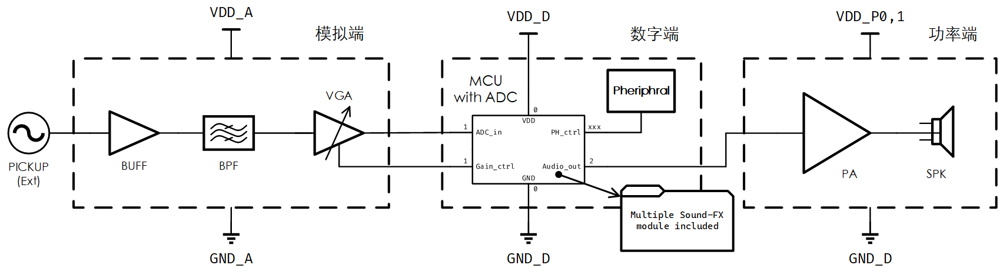
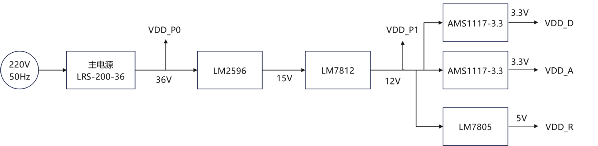

# 数字电吉他音箱 开题报告

## 背景调研

电吉他在现代音乐中有着广泛的应用，与电吉他音色相关的效果链路的研究是现代音频工程的重要的一部分内容。电吉他音箱作为电吉他音色效果链路中的一个重要环节，对于电吉他演奏的音色塑造有着重要的作用，因此一个具有较好音效的电吉他音箱具有较高的应用价值。

随着现代音频工程的发展，为了获取更好的音效，通过数字算法替代传统笨重的模拟电路来实现更加精细和丰富的电吉他音色的方法正逐渐成为主流，并且方法愈发先进和丰富。一种可行的方法是将效果链路的所有部分都使用软件实现，信号输入与效果监听分别通过声卡、监听音箱或耳机等配套设备来实现，这种方法容易局限于较为复杂的配套设备。而另外的做法是将数字算法处理音效与实体电吉他音箱结合，进而产生了数字电吉他音箱。这类设备即保留了传统电吉他音箱对与电吉他演奏的适配性又结合了数字效果的灵活性，在实际使用中有着独特的价值。在当前的市场上，诸如Roland Boss Katana、Blackstar ID Core、Yamaha THR等系列产品广受欢迎，同时也有越来越多的新产品正在出现。

## 系统功能

电吉他音箱是专门适配电吉他的音响设备，其核心功能是通过内置处理模块，渲染出符合现代音乐需求的各类音色。其中，数字音箱区别于传统模拟音箱的核心特征，在于其音频处理模块采用数字化方式实现——传统电吉他的音色塑造与渲染依赖笨重的模拟电路，而现代主流方式是将这一核心模块数字化，通过DSP（数字信号处理）算法，精准模拟真实模拟设备的音色质感，同时也可突破传统限制，创造出全新的音效风格。

设备智能化则是受各类AI硬件设备的启发。我们希望加入语音识别并接入AI模型，用户通过语音即可完成音色的合成，省去传统音箱繁杂的参数调节环节；同时借助AI的交互与辅助能力，为用户的演奏练习与音乐创作提供灵感支持。

本音箱同时集成了调音器的功能，可在输出音频的同时实现音高识别，便于用户对琴弦进行调节与校准。

根据前文的描述与模块划分，该项目计划最终实现如下目标：

1. 实现一个能够正常正常放大并进行电吉他演奏的音箱；
2. 音箱具备输入校音功能；
3. 音箱具备利用数字算法调节音色的功能，音色的调节可以通过物理旋钮、按键等方式来实现。

## 三、系统架构

### 整体说明

我们计划将本课题分为如下几个部分：电源链路、模拟前端、数字端、功率端以及辅助设备。

主系统框图如下：

电源链路如下：

信号由外部拾音器（PICKUP）或信号源（Ext）输入。

由于大部分模块不能在220V的交流电上工作，因此硬件部分需解决供电问题。不同的模块对供电轨有不同的需求，且存在对电源变化敏感的模块，因此刚需性能良好的电源链路。电源链路包含AC-DC变压、DC-DC降压（Buck Converter）、线性稳压器（Linear Regulator），为各个模块提供所需的供电轨。

模拟前端主要包含缓冲器（BUFF）、带通滤波器（BPF）、可变增益放大器（VGA），负责隔离设备的内外，同时对信号进行带通滤波以及前置放大/衰减，以满足ADC的输入幅度需求。模拟前端同时囊括模数/数模转换器（AD/DA），实现模拟信号输入-数字端处理-模拟功率放大输出的信号链路。

数字端包含单片机（MCU），以及外设（语音识别、屏显、按键等）；效果器（Sound-FX）链路实现音色的数字合成，在MCU内部通过DSP算法实现。

功率端包含功率放大器（PA）以及扬声器（SPK），实现音频信号的放大输出。

辅助设备包含音箱箱体等物理结构体。

#### 电源链路

本系统电源模块采用模块化设计思路，选用AC-DC变压、LDO稳压相结合的方案，以满足吉他音箱系统中功放、前置模拟处理及数字控制等不同部分对供电的差异化需求。

第一级转换为业界通用的AC-DC变压，将220V交流电转为中间电压的直流供电，可供功放使用。选用成品交流-直流开关电源模块MEAN WELL LRS-200-36，该电源可直接将220V交流电转换为固定36V直流输出VDD_P0，额定功率为200W，能够满足功放模块对大功率供电的需求。该模块具有效率高、体积小、具备过压、过流及短路保护等优点，适合本系统快速实现与稳定运行。

第二级转换采用一路DC-DC开关电源降压，首先将36V主电源输出电压通过LM2596开关电源芯片降压至15V，接着为降低开关电源引入的高频噪声对功放模块和最前端模拟模块的影响，将15V输出电压输入至LM7812线性稳压芯片，输出12V固定电压至VDD_P1作为功率端预放大器的供电轨。

第三级转换主要针对数字模块和模拟模块供电。利用LM7812输出的12V电压，将其分为两路，分别输入AMS1117-3.3线性稳压电源芯片，分别固定输出3.3V至VDD_D和VDD_A作为数字端和模拟端芯片供电。另外，再将输出的12V电压分出一路输入线性稳压电源芯片LM7805，固定输出5V电压至VDD_R，作为备用电源，以备不时之需。

### 模拟前端

主要功能如下：

- 缓冲+隔离：向前级拾音器呈现高阻，向后级电路呈现低阻
- 带通滤波：保留感兴趣频段内的信号，滤除其他频段的干扰
- 前置放大/衰减：根据输入信号的幅度做一定的放大或衰减，送入ADC。
- 数模/模数转换：将拾音器的模拟信号转换为数字信号，进行DSP，再转回模拟信号进行功率放大

这里感兴趣的频段是20Hz\~20kHz（人耳可分辨的频率范围，后称*听觉频段*）。

**方案对比——整体架构**

这里主要说明芯片级的考量。上述功能可通过独立的芯片实现，也可通过一块整体的编解码器（CODEC）实现。CODEC是一种适用于音频信号的多功能芯片，其内部包含了ADC、DAC、音量控制、数字滤波等功能。这里采用CODEC方案，因其避免了多芯片的使用，减少通信开销以及设计负担。

CODEC芯片目前选用TI的TAC5x1x系列。

尽管使用了集成了诸多功能的CODEC芯片，输入隔离缓冲仍是需要的。拾音器的输出阻抗在几十kΩ左右，与CODEC芯片ADC的输入阻抗基本一致，因此需要一级缓冲向前后级呈现合适的阻抗。

有关带通滤波器与前置增益级的方案讨论在后续模块说明部分单独叙述。

**方案对比——单双通路**

我们预期实现音高识别与音色合成与播放的功能

对于音高识别，音高取决于基频分量的频率，大概位于80-1.3kHz的范围内（下称*基频频段*）。音高/频率识别主要有两种方式，其一是时域的自相关算法，其二是频域的FFT算法。自相关实现较为简单，且对算力需求不大，但受高次谐波影响严重，因此时域方法需要以仅保留基频频段的信号作为算法输入；FFT对算力有一定要求，但无需仅保留基频，只需观察谱线位置即可得到音高。我们最终选择了FFT作为音高识别的算法。

对于音色合成与播放，由于乐器拾音器输出幅度根据实际测量，正常弹奏与扫弦时的峰峰值可达2Vpp，拨弦时的峰峰值约为300mVpp。的输出不可能仅包含单独的基频分量，其特殊的音色实际上很大程度上由泛音（高次谐波）有关。泛音频率可达15kHz，接近听觉频段的最高频。因此音色合成以及功率放大需要保留整个听觉频段的信号。

如此，根据输入信号在内部的通路数，引出了两种方案——单通路与双通路。

在双通路方案中，存在校音通路（Ⅰ路）与功放通路（Ⅱ路）。前者用于音高校准，通过基频频段的带通滤波器；后者用于电吉他的声音输出，通过听觉频段的带通滤波器。由选通信号控制通路是否打开。

在单通路方案中，输入信号仅通过更宽的听觉频段带通滤波器，经ADC数字化后再决定送往音高识别或音色合成，甚至是直接旁通到功放。

我们选择单通路方案，原因在于双通路的硬件数近乎翻倍，且占用ADC的通道数。另外，由于我们选择了FFT作为音高识别的算法，基频频段的带通滤波不再必需，完成听觉频段的滤波即可。

#### 缓冲器 BUFF

缓冲器作为模块内外的隔离，实现阻抗变换：高输入阻抗作为拾音器的负载、低输出阻抗驱动后级。

CMOS运放具有极高的输入阻抗，因此可以将CMOS运放接成电压跟随器以实现缓冲与隔离功能。拾音器不能直接连接CMOS运放的输入管脚，因为运放对输入共模电平有一定要求，需要额外提供确定的共模电平（偏置）。采用AC耦合，通过电阻分压网络提供半供电轨（VDD_A/2）的共模电平。

在此之外，缓冲器需要具有一定的*过压过流保护*能力。绝大部分的集成CMOS运放都已内置保护电路，但保险起见，在其外添加肖特基二极管组成的输入钳位电路。

目前考虑使用OPAx323或OPAx310系列运放，因其具有单位增益稳定性，且拥有SHDN关断引脚。

#### 带通滤波器 BPF

滤波器存在两类方案，一类是数字实现，另一类是模拟实现。

尽管TAC5x1x内部集成了数字双二阶滤波器，可以呈现多种频率响应，其需要通过I2C对内部寄存器进行配置。TI提供了一款软件——PurePath Consule 3通过图形化界面（GUI）完成对CODEC的配置，但该软件需要在TI官方页面购买器件后向TI申请使用。而我们大概率不会从TI官方订购，因此无法使用该软件，只能手动配置。这里为保险起见，先进行独立带通滤波器的电路设计，即模拟实现方案。

目前考虑使用二阶低通、高通Sallen-Key有源滤波器，Butterworth响应，增益为1（尽可能不引入插损）。运放采用OPAx376（优选-低噪声）或TLVx376。

#### 可调增益放大器 VGA

拾音器是单端输出，其输出幅度根据实际测量，正常弹奏与扫弦时的峰峰值可达2Vpp，拨弦时的峰峰值约为300mVpp。对于任意的输入音频信号，其幅度未知，因此有必要设置一级可变增益的放大器以适应不同幅度的输入，避免增益过大产生饱和失真，或者增益过小ADC以及频率检测输出错误结果。

对于所选取的CODEC芯片TAC5111，其ADC满量程输入为单端1Vrms，差分2Vrms。这里为节省硬件，选择保持传输单端信号。CODEC芯片支持内部音量衰减与放大（-80dB到47dB的调节范围），可以不自己单独搭建放大器电路。

通过MCU对CODEC的控制，可以实现增益变化。CODEC支持自动增益控制（AGC）功能，可以令输出幅度保持在一个固定的值。此项功能适合语音信号的放大，不适合乐器音频的放大，原因在于后者具有两维度信息，其一是音高（频率），其二是力度（幅度）。若使用AGC，则会丢失力度维度的信息，音乐听感平淡。

### ADC与DAC

对于所选取的CODEC芯片TAC5111，其采样频率在4kHz至768kHz内可调，其采样位数可在16-32位内可调。CD标准的采样率为44.1kHz，采样位数16bit，我们选择与CD标准一致的频率。

### 数字端

==zmx部分==MCU选型+效果器实现

数字端有两重功能，其一是实现对周边外设的控制，如控制是否接入调音、控制屏显内容；其二是实现软件端的算法，包含频率检测以及音色合成。

计划采用STM32系列单片机，并配备SDRAM来实现音色处理，配备屏幕来显示当前音色处理效果，配备物理旋钮和按键来实现对效果算法中的参数进行实时调节

对于单片机的性能有以下要求：

- 片上ADC采样率与精度：为保证全频段采样，采样率至少达到Nyquist频率（40kHz）；精度暂定12位
- 主频与算力：需要能完成频率的**实时检测**，同时能满足数字效果器所需的计算，合成音色。

如果测试发现单片机的片上ADC无法满足要求，需要使用单独的ADC芯片。

#### 音高识别

功能上，需要完成输入信号频率的测量；允许用户设置标准音高频率；输出当前音高以及相对标准音高的偏离程度。

算法上，常见使用自相关或FFT。前者是时域上的处理。后者是频域上的处理。

计算自相关对算力要求不算大，常用的单片机能够胜任；计算FFT对算力有一定要求，单片机可能无法满足实时检测。

#### 效果器

==zmx部分==

电吉他的音色合成常用数字合成方式，在数字端代替传统笨重的模拟电路的效果，如斩波等失真，从而对电吉他的音色进行处理。我们需要编写特定的DSP算法来实现特定的效果，如噪音门、压缩、失真、均衡、混响、过载、调制等。

### 功率端

本项目中功放模块主要用于驱动音箱扬声器。由于音箱所选扬声器要求功率≥100 W，因此我们选择TPA3255作为后级功率放大芯片。TPA3255是TI的一款高性能D类功放芯片，支持BTL桥接输出，相比单端输出能够实现更大的输出功率。在1%THD+N（总谐波失真+噪声）的情况下，在4Ω负载下最大输出可达260W，在8Ω负载下最大输出可达150W，满足本项目扬声器的驱动需求，并保留一定的余量，能实现高保真放大。同时该芯片具有效率高、发热小的特点，效率可达90%，相比传统线性功放更适合用于数字音箱类设备。此外，TPA3255内部集成了过流、过温和短路保护功能，保障音箱系统运行的可靠性和安全性。

在确定后级芯片后，本设计采用“前级信号调理 + 后级功率放大”的整体架构。前级部分选用NE5532低噪声运放芯片，用于对输入音频信号进行放大、缓冲和失真校正，为后级提供稳定、纯净且幅度合适的输入信号。

数字模块输出的数字音频信号经DAC转换为模拟音频信号后，再送入本功放模块。为了充分利用DAC的输出动态范围并获得较好的信噪比，DAC输出应尽量接近满量程工作。因此，本设计将音箱的音量调节功能设置在功放模块前级输入部分实现，而不是通过调节数字信号“幅度”实现。后级部分则由TPA3255完成功率放大，实现对扬声器的驱动。

具体而言，输入信号首先经过耦合电容进行隔直，然后进入电位器构成的可调衰减网络，通过改变电位器滑动端位置，可对输入音频信号幅度进行连续调节。NE5532前一级采用反相放大结构，完成初步电压放大，并通过补偿网络抑制高频噪声、防止自激；后一级作为缓冲和进一步放大级，提高输出驱动能力并增强前后级之间的隔离。经过前级处理后的信号输入TPA3255，进行D类功率放大，并采用BTL输出。由于D类功放输出中含有高频PWM分量，因此在输出端加入LC滤波网络，对高频开关噪声进行滤除，从而恢复音频信号并驱动扬声器正常工作。

在供电方面，前级NE5532采用12V的`VDD_P0`供电，后级TPA3255采用36V的`VDD_P1`供电（同时需要12V的逻辑电平，共用`VDD_P0`）。电源引脚需并联电容进行滤波，以减小供电噪声对音频信号的影响。 

## 人员分工

赵墨轩（组长）：音色合成与数字效果器的实现、音高识别算法、整体统筹规划

李雨洲：电源链路、外设（旋钮等）对效果器参数的调整

王静扬：模拟前端BUFF的电路设计、CODEC的配置以及与MCU之间的I2S/I2C通信

赵嘉明：功率端电路设计，屏显与UI设计，PCB绘制

## 参考文献

[1] Texas Instruments. TPA3255 315-W Stereo/600-W Mono PurePath Ultra-HD Analog-Input Smart Amplifier Data Sheet (Rev. A)[Z/OL]. Texas Instruments, 2016.

[2] Texas Instruments. 同相放大器技术文档[Z/OL]. Texas Instruments.

[3] Texas Instruments. NE5532 Dual Low-Noise Operational Amplifier Data Sheet[Z/OL]. Texas Instruments.

[4] Razavi B. 模拟CMOS集成电路设计[M].西安:西安交通大学出版社, 2003.

[5] 康华光.电子技术基础[M].人民教育出版社,1982.

[6] 嘉立创开源广场. TPA3255大功率HI-FI功放项目[EB/OL]. https://oshwhub.com/lyhnbnb/tpa3255-high-power-amplifier-boa

[7] 芯语. 一个单片机ADC的挖坑填坑之旅[EB/OL]. https://www.eet-china.com/mp/a17600.html

[8] 野火电子. STM32开发指南（28. ADC—电压采集）[EB/OL]. https://doc.embedfire.com/mcu/stm32/f103/hal_general/zh/latest/doc/chapter29/chapter29.html

[9] OPPENHEIM A V, SCHAFER R W, BUCK J R. *Discrete-Time Signal Processing*[M]. 2nd ed. Upper Saddle River: Prentice-Hall, 1999.

[10] Nonlinear Distortion[EB/OL]. [2026-03-19]. https://www.dsprelated.com/freebooks/pasp/Nonlinear_Distortion.html.

[11] 佚名。电声技术，2010 (10): 7. DOI:10.3969/j.issn.1002-8684.2010.10.007.

[12] 佚名。电声技术，2008 (05): 16. DOI:10.16311/j.audioe.2008.05.016.

[13] 陈三强。基于 DSP 的数字音效系统设计 [D]. 湘潭：湘潭大学，2016.
