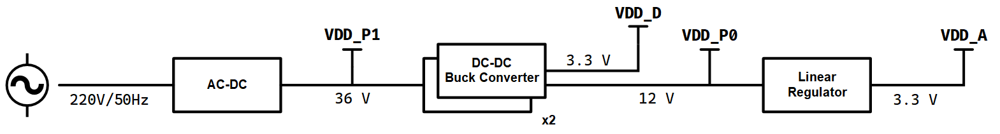

# 智能数字电吉他音箱 开题报告

## 一、背景调研

电吉他在现代音乐中有着广泛的应用，与电吉他音色相关的效果链路的研究是现代音频工程的重要的一部分内容。电吉他音箱作为电吉他音色效果链路中的一个重要环节，对于电吉他演奏的音色塑造有着重要的作用，因此一个具有较好音效的电吉他音箱具有较高的应用价值。

随着现代音频工程的发展，为了获取更好的音效，通过数字算法替代传统笨重的模拟电路来实现更加精细和丰富的电吉他音色的方法正逐渐成为主流，并且方法愈发先进和丰富。一种可行的方法是将效果链路的所有部分都使用软件实现，信号输入与效果监听分别通过声卡、监听音箱或耳机等配套设备来实现，这种方法容易局限于较为复杂的配套设备。而另外的做法是将数字算法处理音效与实体电吉他音箱结合，进而产生了数字电吉他音箱。这类设备即保留了传统电吉他音箱对与电吉他演奏的适配性又结合了数字效果的灵活性，在实际使用中有着独特的价值。在当前的市场上，诸如Roland Boss Katana、Blackstar ID Core、Yamaha THR等系列产品广受欢迎，同时也有越来越多的新产品正在出现。

同时，伴随当前AI技术的不断发展，智能化的设备也开始出现。数字效果器能提供更灵活和丰富的音色，但通常伴随着更加复杂和困难的模块与参数的调节。与AI结合的智能化设备可以帮助使用者省去繁杂的参数调节环节，能为使用者的练习和创作提供更多支持和灵感。

## 二、系统功能

电吉他音箱是专门适配电吉他的音响设备，其核心功能是通过内置处理模块，渲染出符合现代音乐需求的各类音色。其中，数字音箱区别于传统模拟音箱的核心特征，在于其音频处理模块采用数字化方式实现——传统电吉他的音色塑造与渲染依赖笨重的模拟电路，而现代主流方式是将这一核心模块数字化，通过DSP（数字信号处理）算法，精准模拟真实模拟设备的音色质感，同时也可突破传统限制，创造出全新的音效风格。

设备智能化则是受各类AI硬件设备的启发。我们希望加入语音识别并接入AI模型，用户通过语音即可完成音色的合成，省去传统音箱繁杂的参数调节环节；同时借助AI的交互与辅助能力，为用户的演奏练习与音乐创作提供灵感支持。

本音箱同时集成了调音器的功能，可在输出音频的同时实现音高识别，便于用户对琴弦进行调节与校准。

根据前文的描述与模块划分，该项目计划最终实现如下目标：

1. 实现一个能够正常正常放大并进行电吉他演奏的音箱。
2. 音箱具备输入校音功能，具备利用数字算法调节音色的功能，音色的调节可以通过物理旋钮、按键等方式来实现。数字算法可由上位机传输至主控。
3. 音箱具备一个智能体，可以通过语音交互的方式辅助用户快速将参数调节至特定预设。

## 三、系统架构

### 整体说明

我们计划将本课题分为如下几个部分：模拟前端（电源链路、输入滤波与前置放大）、数字端（音高识别、音色合成以及周边外设的控制）、功率端（功率放大与扬声器）以及外围设备。

主系统框图如下：

电源链路如下：

信号由外部拾音器（PICKUP）或信号源（Ext）输入。

由于大部分模块不能在220V的交流电上工作，因此硬件部分需解决供电问题，刚需良好的电源链路。电源链路包含AC-DC变压、DC-DC降压（Buck Converter）、线性稳压器（Linear Regulator），为各个模块提供所需的供电轨。

模拟前端包含缓冲器（BUFF）、带通滤波器（BPF）、可变增益放大器（VGA），负责隔离设备的内外，同时对信号进行带通滤波以及前置放大，以满足ADC数字化的输入幅度需求。

数字端包含单片机（MCU），片上/片外ADC，以及外设（语音识别、屏显、按键等）；效果器（Sound-FX）实现音色的数字合成，通过MCU（若有需要，添置DSP芯片）内部算法实现。

功率端包含功率放大器（PA）以及扬声器（SPK），实现DSP后数字音频信号的放大输出。

### 模拟前端

主要功能如下：

1. 模拟滤波与放大：将拾音器输出的微弱模拟信号（峰峰值一般小于0.5Vpp），经带通滤波后放大，为后续的数字算法（频率检测、音色生成）以及数字音频信号的功率放大提供高质量的原始数据。

2. 音高校准：ADC将模拟信号数字化后，通过软件侧的频率检测算法，识别当前音高频率，并与用户设置的基准音高频率进行比较，将当前音高与差异可视化，输出至屏显。

**方案对比**

人耳可分辨的极限频率范围大致是20Hz\~20kHz（后称*听觉频段*），需要带通滤波器保留该频段内的信号，滤除其他干扰。吉他常见音高对应的频率分布在80Hz\~1.3kHz（后称*基频频段*）内，泛音/高次谐波可达10kHz。

对于音高识别，其主要是测量基频的频率。拾音器输出中很可能出现高次谐波幅度高于基波幅度的情况，会影响后续数字算法对频率的测量，因此需要基频频段的带通滤波器。

对于后续放大输出，由于吉他的音色是基频与泛音共同的作用的结果，为保证音色的饱满，不能使用经基频频段滤波后的信号。

从以上两点可看出，本模块需要两个带通滤波器。根据带通滤波器在链路中所处的位置以及实现，有以下方案：

- 双通路+全模拟滤波

设计有两路通路——校音通路（Ⅰ路）与功放通路（Ⅱ路）。前者用于音高校准，通过基频频段的带通滤波器；后者用于电吉他的声音输出，通过听觉频段的带通滤波器。由选通信号控制通路是否打开。两个滤波器均通过模拟实现。

- **单通路+基频频段数字滤波**

设计仅有单通路，听觉频段带通滤波器为模拟实现，基频频段通过ADC采样后数字滤波得到。

本模块采用单通路的方案，原因如下：

1. 仅需一个模拟滤波器，降低硬件设计成本；
2. 引入更少的模拟器件噪声，更小的温漂；
3. 数字滤波的可调性远胜模拟滤波，可根据需要调整频段与效果。

#### 电源链路

本系统电源模块采用模块化设计思路，选用AC-DC变压、DC-DC降压、LDO稳压相结合的方案，以满足吉他音箱系统中功放、前置模拟处理及数字控制等不同部分对供电的差异化需求。

第一级转换为业界通用的AC-DC变压，将220V交流电转为中间电压的直流供电，可供功放使用。选用成品交流-直流开关电源模块MEAN WELL LRS-200-36，该电源可直接将220V交流电转换为36V直流输出`VDD_P1`，额定功率为200W，能够满足功放模块对大功率供电的需求。该模块具有效率高、体积小、具备过压、过流及短路保护等优点，适合本系统快速实现与稳定运行。

第二级转换采用两路DC-DC开关电源降压，第一路将36V降至12V的`VDD_P0`，作为功率端预放大器的供电轨；第二路将36V直接降至3.3V的`VDD_D`，供给数字模块使用。开关电源芯片选择LM2596。

为降低开关电源引入的高频噪声对最前端模拟音频信号的影响，在关键模拟电路模块供电路径中引入线性稳压器LM7812线性稳压器进行二次稳压处理，以提高电源纯净度，从而改善音频系统的整体性能。在本设计中，将12V的`VDD_P0`线性稳压至3.3V，作为模拟前端的供电`VDD_A`。模拟前端与数字端供电电平一致，尽可能减少直流电平转换的开销。

采用开关电源为各模块供电，以提高效率和降低体积，同时在前级音频电路中使用线性稳压进行二次滤波以降低噪声和稳定电压，从而兼顾音质和系统实现难度。不直接采用线性电源的原因在于，虽然线性电源具有低噪声优势，但在大功率场景下效率低、体积大。

#### 缓冲器 BUFF

缓冲器作为模块内外的隔离，实现阻抗变换：高输入阻抗作为拾音器的负载、低输出阻抗驱动后级。

CMOS运放具有极高的输入阻抗，因此可以将CMOS运放接成电压跟随器以实现缓冲与隔离功能。拾音器不能直接连接CMOS运放的输入管脚，运放对输入共模电平有一定要求，需要额外提供确定的共模电平（偏置）。暂采用AC耦合，通过电阻分压网络提供半供电轨（VDD_A/2）的共模电平。

在此之外，缓冲器需要具有一定的*过压过流保护*能力。绝大部分的集成CMOS运放都已内置保护电路，但保险起见，在其外添加肖特基二极管组成的输入钳位电路，使输入电压钳位在VDD_A和GND之间，避免静电或大信号损坏运放。

目前考虑使用OPAx310系列运放。

#### 带通滤波器 BPF

根据先前的方案调研，这里带通滤波指听觉频段的滤波。

滤波器存在两类方案，一类是数字实现，另一类是模拟实现。

- 数字实现

该方案中，滤波器位于ADC采样之后，在单片机内通过软件算法实现。

- 模拟实现

该方案中，滤波器位于ADC采样之前，通过物理器件实现。

- 对比

| **方案** |                        **优点**                        |                           **缺点**                           |
| :------: | :----------------------------------------------------: | :----------------------------------------------------------: |
| 数字实现 | 软件端易于实现，省去了器件上的考虑 通带范围容易调整 | 效果有限，受限于ADC的性能 频率检测可能受高次谐波/泛音干扰 |
| 模拟实现 |             不受限于ADC的性能以及谐波干扰              | 需要一定模拟电路的设计 通带范围难以调整（需要调整电子器件的参数） 引入硬件器件噪声 |

本模块选取模拟实现，暂取一阶无源带通滤波器，若有必要再考虑有源滤波器。

#### 可调增益放大器 VGA

由于拾音器的信号幅度有限，一般无法满足后续ADC与频率检测对幅度的要求，因此需要设置一级放大器。该级放大器的增益可调，以适应不同幅度的输入，避免增益过大产生饱和失真，或者增益过小ADC以及频率检测输出错误结果。

**同相放大电路**是常用的电路拓扑，通过**控制反馈电阻的阻值**实现增益可调。输入采用AC耦合，输入共模电平设置为VDD/2；输出电平在VDD/2附近，可最大化利用ADC的输入范围。

基于增益是否自动控制，存在两种实现方案：

- 手动增益调整

通过一个旋钮（电位器）调整反馈电阻。后续数字端ADC采样后可指示VGA的输出幅度，从而判断增益是否合适。

- 自动增益控制

反馈电阻通过数控电阻阵列实现。数字端ADC采样后，根据幅度控制接入的反馈电阻阻值。

- 对比

|   **方案**   |   **优点**   |               **缺点**                |
| :----------: | :----------: | :-----------------------------------: |
| 手动增益调整 |   电路简单   |     依赖用户调整，增加操作复杂度      |
| 自动增益控制 | 无需用户操作 | 电路复杂-数控电阻阵列 额外算法实现 |

本模块计划以自动增益控制作为最终实施方案，但设计前期采用手动控制保证基本功能的实现。

### 数字端

数字端有两重功能，其一是实现对周边外设的控制，如控制是否接入调音、控制屏显内容；其二是实现软件端的算法，包含ADC以及后续的频率检测以及后续音色的合成。

计划采用STM32系列单片机，搭配专用的DSP芯片并配备SDRAM来实现音色处理，配备屏幕来显示当前音色处理效果，配备物理旋钮和按键来实现对效果算法中的参数进行实时调节

对于单片机的性能有以下要求：

- 片上ADC采样率与精度：为保证全频段采样，采样率至少达到Nyquist频率（40kHz）；精度暂定12位
- 主频与算力：需要能完成频率的**实时检测**，同时能满足数字效果器所需的计算，合成音色。

如果测试发现单片机的片上ADC无法满足要求，需要使用单独的ADC芯片。

#### 音高识别

功能上，需要完成输入信号频率的测量；允许用户设置标准音高频率；输出当前音高以及相对标准音高的偏离程度。

算法上，常见使用自相关或FFT。前者是时域上的处理。后者是频域上的处理。

计算自相关对算力要求不算大，常用的单片机能够胜任；计算FFT对算力有一定要求，单片机可能无法满足实时检测。

#### 效果器

电吉他的音色合成常用数字合成方式，在数字端代替传统笨重的模拟电路的效果，如斩波等失真，从而对电吉他的音色进行处理。我们需要编写特定的DSP算法来实现特定的效果，如噪音门、压缩、失真、均衡、混响、过载、调制等。

#### 智能控制

本音箱内置了智能音色合成与语音控制能力，需要在外部训练模型并导入，以及MCU相关控制代码的编写。

### 功率端

本项目中功放模块主要用于驱动音箱扬声器。由于音箱所选扬声器要求功率≥100 W，因此我们选择TPA3255作为后级功率放大芯片。 TPA3255 是TI的一款高性能D类功放芯片，支持BTL桥接输出，相比单端输出能够实现更大的输出功率。在1%THD+N（总谐波失真+噪声）的情况下，在4 Ω负载下最大输出可达260W，在8 Ω负载下最大输出可达150 W，满足本项目扬声器的驱动需求，并保留一定的余量，能实现高保真放大。同时该芯片具有效率高、发热小的特点，效率可达90%，相比传统线性功放更适合用于智能音箱类设备。此外，TPA3255内部集成了过流、过温和短路保护功能，保障音箱系统运行的可靠性和安全性。

在确定后级芯片后，本设计采用“前级信号调理 + 后级功率放大”的整体架构。前级部分选用 NE5532低噪声运放芯片，用于对输入音频信号进行放大、缓冲和失真校正，为后级提供稳定、纯净且幅度合适的输入信号；后级部分则由 TPA3255完成功率放大，实现对扬声器的驱动。输入信号首先经过耦合电容进行隔直，再通过偏置网络为NE5532提供稳定工作点。NE5532前一级采用反相放大结构，完成初步电压放大，并通过补偿网络抑制高频噪声、防止自激；后一级作为缓冲和进一步放大级，提高输出驱动能力并增强前后级之间的隔离。经过前级处理后的信号输入TPA3255，进行D类功率放大，并采用BTL输出。由于D类功放输出中含有高频PWM分量，因此在输出端加入LC滤波网络，对高频开关噪声进行滤除，从而恢复音频信号并驱动扬声器正常工作。 

在供电方面，前级NE5532采用 12 V的`VDD_P0`供电，后级TPA3255采用 36 V的`VDD_P1`供电。电源引脚需并联电容进行滤波，以减小供电噪声对音频信号的影响。 

## 人员分工

赵墨轩（组长）：音色合成算法、统筹规划

李雨洲：电源链路

王静扬：模拟前端、音高识别

赵嘉明：功率端

外设控制与AI模型的训练所有人均参与。

## 参考文献

[1] Texas Instruments. TPA3255 315-W Stereo/600-W Mono PurePath Ultra-HD Analog-Input Smart Amplifier Data Sheet (Rev. A)[Z/OL]. Texas Instruments, 2016.

[2] Texas Instruments. 同相放大器技术文档[Z/OL]. Texas Instruments.

[3] Texas Instruments. NE5532 Dual Low-Noise Operational Amplifier Data Sheet[Z/OL]. Texas Instruments.

[4] Razavi B. 模拟CMOS集成电路设计[M].西安:西安交通大学出版社, 2003.

[5] 康华光.电子技术基础[M].人民教育出版社,1982.

[6] 嘉立创开源广场. TPA3255大功率HI-FI功放项目[EB/OL]. https://oshwhub.com/lyhnbnb/tpa3255-high-power-amplifier-boa

[7] 芯语. 一个单片机ADC的挖坑填坑之旅[EB/OL]. https://www.eet-china.com/mp/a17600.html

[8] 野火电子. STM32开发指南（28. ADC—电压采集）[EB/OL]. https://doc.embedfire.com/mcu/stm32/f103/hal_general/zh/latest/doc/chapter29/chapter29.html

[9] OPPENHEIM A V, SCHAFER R W, BUCK J R. *Discrete-Time Signal Processing*[M]. 2nd ed. Upper Saddle River: Prentice-Hall, 1999.

[10] Nonlinear Distortion[EB/OL]. [2026-03-19]. https://www.dsprelated.com/freebooks/pasp/Nonlinear_Distortion.html.

[11] 佚名。电声技术，2010 (10): 7. DOI:10.3969/j.issn.1002-8684.2010.10.007.

[12] 佚名。电声技术，2008 (05): 16. DOI:10.16311/j.audioe.2008.05.016.

[13] 陈三强。基于 DSP 的数字音效系统设计 [D]. 湘潭：湘潭大学，2016.